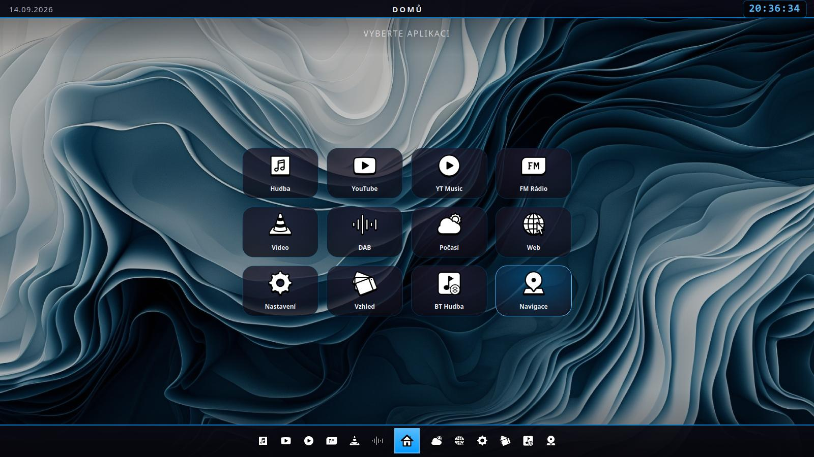
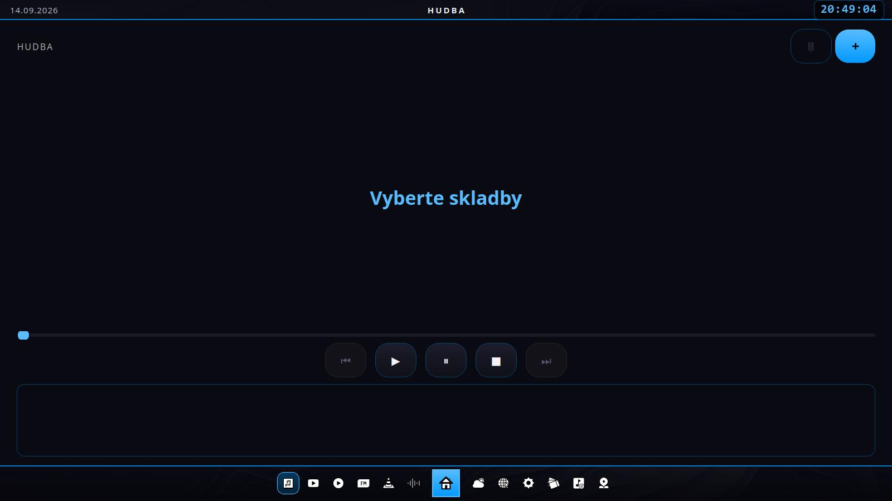
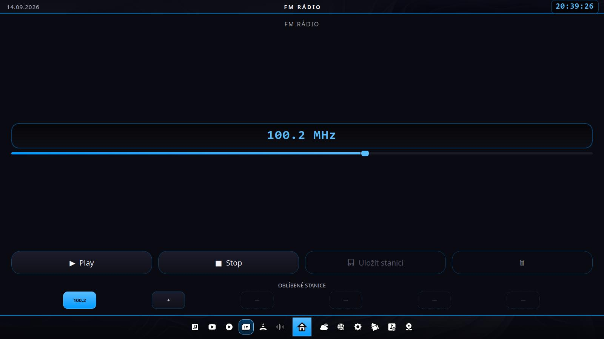
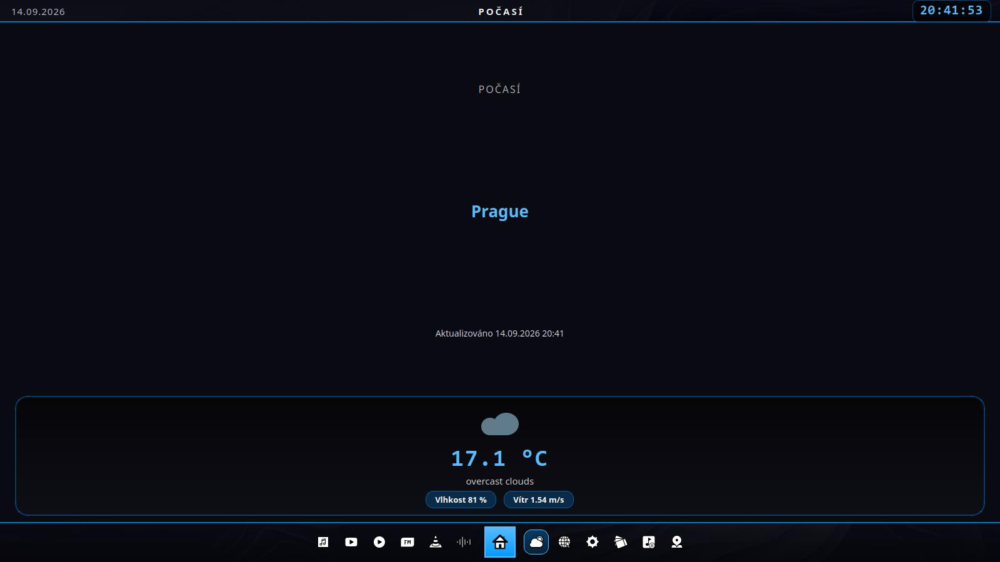
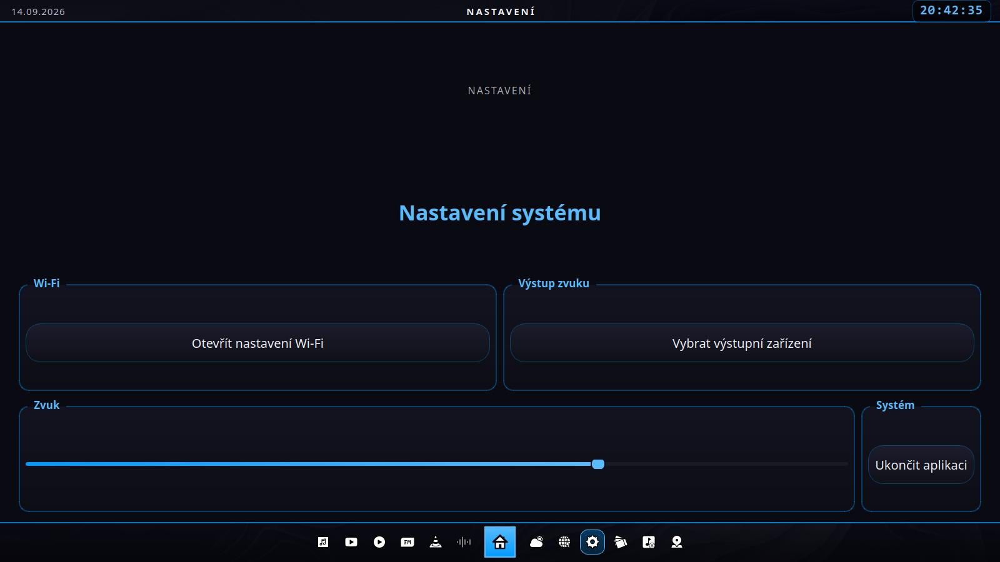
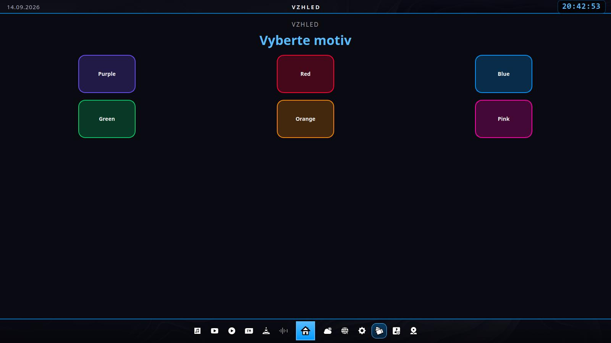
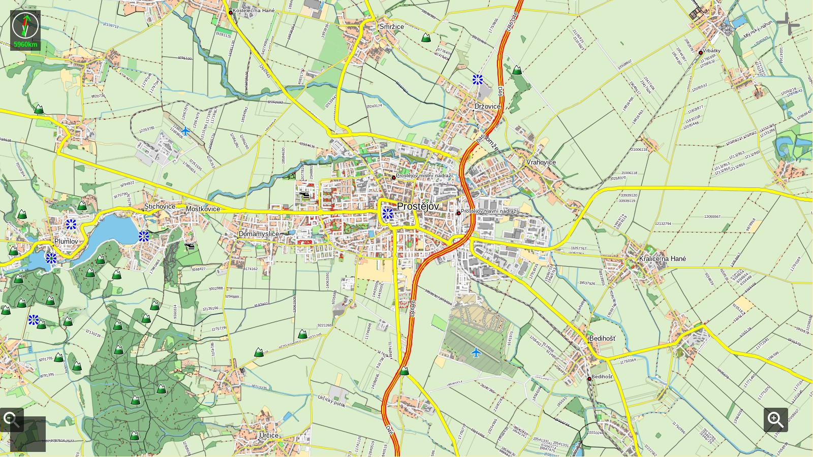

Open Source Autoradio do Linux
==============================

## Novinky ve verzi 14 (zásadní změna - odebrání Map, nový BT Hudba modul)
- **Vestavěné Mapy odebrány** - navigaci už řeší modul Navigace (GNOME Maps), druhý mapový modul byl zbytečná duplicita. Soubor `map.py` i jeho ikona jsou pryč, `python3-pyqt5.qtwebengine` teď v README figuruje jen jako závislost YouTube/YouTube Music.
- **Nový modul BT Hudba** nahrazuje tlačítko Map - ukazuje název skladby/interpreta/alba a stav přehrávání z telefonu streamujícího hudbu přes Bluetooth, plus tlačítka Předchozí/Přehrát-Pauza/Další. Čte a ovládá to přes BlueZ AVRCP (`org.bluez.MediaPlayer1` na D-Bus) - funguje s jakýmkoliv Bluetooth adaptérem, který BlueZ vidí, včetně obyčejného USB dongle (řeší se tím i to, že vestavěný Bluetooth na Orange Pi 5 Pro je nespolehlivý). Nová závislost: `python3-dbus`.

## Novinky ve verzi 13 (podrobný postup pro GPS VK-162)
- **Určování polohy s VK-162** - sekce Navigace v README přepsaná na konkrétní, ověřený postup šitý na míru VK-162 (u-blox čip, `/dev/ttyACM0`, 9600 baud): ověření hardwaru přes `gpsd`/`cgps`, propojení s GeoClue2 přes nástroj `gps-share` (postavený přímo pro tenhle účel, běží jako systemd služba), konfigurace GeoClue2 přes `/etc/geoclue/conf.d/`, a ověření přes `where-am-i` demo nástroj ještě před otevřením GNOME Maps.

## Novinky ve verzi 12 (potvrzené opravy z reálného nasazení)
- **welle.io - potvrzený přesný fix pro Qt6** - podle skutečné chybové hlášky z Orange Pi 5 Pro (`module "QtCore" is not installed`) stačí `sudo apt install qml6-module-qtcore qml6-module-qtquick-dialogs`. Qt5 varianta zůstává jako záloha pro starší systémy.
- **Fyzické tlačítko napájení** - nová sekce v Kiosk režimu s nastavením, aby stisk vypínacího tlačítka rovnou vypnul zařízení bez čekání na potvrzovací dialog (`HandlePowerKey=poweroff` v `systemd-logind`, plus potlačení GNOME potvrzovacího dialogu pro případ běhu mimo kiosk režim).

## Novinky ve verzi 11 (druhé kolo oprav po testu na zařízení)
- **welle.io (DAB) se nespouštěl** - je to samostatná Qt/QML appka a potřebuje QML runtime moduly navíc, které jsem v jedné z dřívějších verzí omylem vyřadil z README (kontroloval jsem tehdy jen, co používá náš vlastní Python kód, a přehlédl, že tenhle konkrétní balíček je potřeba pro welle.io samotné). Vráceno zpět + přidaný návod, jak si přesně přečíst z terminálu, který konkrétní modul chybí.
- **Určování polohy v GNOME Maps s USB GPS přijímačem** - přidaný podrobný postup (`gpsd` + ověření přes `cgps`, propojení s GeoClue2) do sekce Navigace v README.
- **Bluetooth přehrávání hudby z telefonu pořád nešlo** - chyběl běžící "agent", který by potvrzoval příchozí párování (samotné zviditelnění nestačí). Kiosk instalátor teď navíc nainstaluje `bluez-tools` a na pozadí spouští `bt-agent`, který páry potvrzuje automaticky.

## Novinky ve verzi 10 (opravy po testu na reálném zařízení)
- **Hudební přehrávač**: tlačítko „+" neotvíralo dialog pro výběr souboru pod kiosk prostředím (matchbox) - vynucený `DontUseNativeDialog` + velikost dialogu shodná s celoobrazovkovým hlavním oknem způsobovaly, že se dialog otevřel za hlavním oknem. Přepsáno na stejné, ověřeně funkční volání jako u Videa.
- **Počasí**: po načtení dat (velká ikona + digitální font) mohl layout narůst nad dostupnou výšku a zatlačit dolní lištu mimo obrazovku. Zúžený layout Počasí + přidaná pojistka v `main.py` (pevný strop výšky obsahové oblasti), která tohle napříč všemi stránkami znemožňuje do budoucna.
- **Bluetooth**: ikonka v docku teď dělá něco jiného než tlačítko v Nastavení - přepíná viditelnost/párovatelnost desky (`bluetoothctl discoverable/pairable`), aby ji telefon našel a mohl na ni streamovat zvuk (deska jako Bluetooth reproduktor / A2DP sink), místo aby jen otevírala GNOME panel pro správu spárovaných zařízení. Doplněné potřebné systémové balíčky pro Bluetooth audio.
- **RTL-SDR V4**: upřesněná poznámka v README - na testovaném zařízení funguje běžný balíček `rtl-sdr` s V4 dongle bez úprav, ovladač ze zdroje je potřeba jen výjimečně.

## Novinky ve verzi 9
- **README**: doplněné varování a přesný postup pro **RTL-SDR V4** - balíčkový `rtl-sdr` z apt repozitářů tenhle dongle často neumí správně inicializovat (jiný tuner než starší V3), takže by FM Rádio modul mohl hlásit prázdné pásmo, špatnou frekvenci nebo zkreslený zvuk. Přidaný návod na instalaci aktualizovaného ovladače (fork RTL-SDR Blog) ze zdroje, včetně blacklistu výchozího DVB-T ovladače.

## Novinky ve verzi 8
- **README**: sekce "Potřebné knihovny" teď obsahuje i balíčky pro kiosk režim (`xserver-xorg`, `matchbox-window-manager`, `onboard`...), včetně vlastního `apt install` příkazu - dřív byly zmíněné jen uvnitř instalačního skriptu, teď je vidět úplný přehled na jednom místě.

## Novinky ve verzi 7
- Přidaná složka **kiosk/** s jednorázovým instalátorem (`install-kiosk.sh`) pro nasazení bez GNOME desktopu - appka po zapnutí desky naskočí sama na celou obrazovku, žádná přihlašovací obrazovka, žádný spuštěný gnome-shell. GDM se dá kdykoliv zase zapnout zpět, viz README sekce "Kiosk režim".
- Přidaná **dotyková klávesnice** (`onboard`) - v kiosk režimu se nastaví tak, aby se sama zobrazovala při psaní kdekoliv v appce (vlastní dialogy, vestavěné YouTube/Mapy) i v externích GTK oknech (např. zadání Wi-Fi hesla). V dolní liště přibyla i ikonka pro ruční zapnutí/vypnutí klávesnice, kdyby se automatické zobrazení někde nespustilo.

## Novinky ve verzi 6
- Kompletní kontrola kódu a opravy drobných nekonzistencí.
- **README opraveno** - sekce "Potřebné knihovny" teď odpovídá tomu, co appka opravdu volá (odebrané nepoužívané položky jako QML moduly, Pillow, OSRM/docker; doplněné skutečně používané `python3-pyqt5.qtwebengine`, `rtl-sdr`, `wmctrl`, `gnome-control-center`). Opravena i sekce o YouTube (už neběží přes Chromium, ale vestavěně) a Navigaci (žádné OSRM, jen spouštěč GNOME Maps).
- **Vyšperkovaný design** - jemné gradienty na tlačítkách, dlaždicích a liště namísto plochých barev, digitální hodiny v horní liště dostaly vlastní "LCD" rámeček, frekvence FM rádia je teď v podsvíceném displeji připomínajícím skutečné autorádio, počasí má hezčí "chipy" pro vlhkost/vítr, a mezi ikonami aplikací a Bluetooth zkratkou v docku přibyla tenká oddělovací čárka. Vše zůstává odlehčené (žádné náročné grafické efekty), aby appka běžela svižně i na slabším ARM hardwaru.

## Novinky ve verzi 5
- **Spotify odebrán.** Nefungoval kvůli tomu, že Spotify Web Player v embedded prohlížeči hlásí chybu (typicky kvůli DRM/Widevine, které Qt WebEngine defaultně nemá) - takže jsem ho z appky úplně odstranil, aby zbytečně nezabíral místo na ploše.
- **Oprava hudebního přehrávače** - tlačítko „+" (výběr skladby) se dřív po spuštění první písničky schovalo a už nešlo přidat/změnit skladbu bez restartu appky. Teď zůstává vidět a funkční po celou dobu.
- Menší oprava odolnosti: pokud se aplikaci (např. hudebnímu přehrávači kvůli VLC) nepodaří inicializovat i přesto, že modul jde naimportovat, appka to teď zachytí a zobrazí hlášku „není dostupné" místo pádu celé aplikace.
- K **OpenTune** (open-source YouTube Music klient pro Android) - prověřil jsem to a jde o reálný projekt, ale jeho webová verze běží přes cizí cloudovou emulaci (Appetize.io), která má jen pár desítek minut zdarma měsíčně, potřebuje stálé rychlé připojení a není myšlená pro celodenní používání v autě. Proto jsem místo toho embedovaný Android emulátor nedělal - appka už ale obsahuje vestavěné **YouTube Music**, což je přesně ten stejný katalog, který OpenTune sám používá, jen bez zbytečné emulace.

## Novinky ve verzi 4
- **Spotify** přibyl jako další aplikace - běží stejně jako YouTube/YouTube Music vestavěně přes `QWebEngineView` (Spotify Web Player), takže funguje i na ARM zařízeních bez instalace nativního Spotify klienta.
- **Bluetooth ikonka** se přesunula z horní lišty do spodního docku a má teď stejný styl jako ostatní ikonky aplikací (černobílá "sticker" ikona, žádný modrý odznak).
- Tlačítka **Wi-Fi** a **Bluetooth** v Nastavení (i ikonka v docku) teď primárně otevírají nativní panely **GNOME nastavení** (`gnome-control-center wifi` / `gnome-control-center bluetooth`), protože aplikace běží na GNOME. Pokud by `gnome-control-center` chybělo, zkusí se `nm-connection-editor` / `blueman-manager` jako záloha.

## Novinky ve verzi 3
- **YouTube a YouTube Music** už neotevírají samostatné okno Chromia. Běží přímo vestavěné v aplikaci (přes `QWebEngineView`, stejně jako Mapy), takže naskočí rychle a mají stejný formát/rámeček jako ostatní stránky - žádná cizí horní lišta prohlížeče.
- Těžší stránky (YouTube, YouTube Music, Mapy, Počasí) se teď sestavují **líně** - až při prvním otevření, ne hned při startu. Aplikace tak naskočí rychleji.
- **FM Rádio** umí ukládat oblíbené stanice (až 6) - tlačítkem *Uložit stanici* nebo klepnutím na prázdný slot `+`. Klepnutím na uloženou stanici se na ni rádio naladí, `🗑` uloženou stanici smaže.
- V horní liště přibyla **ikonka Bluetooth** pro rychlé otevření párování/nastavení zvukového výstupu přes Bluetooth (stejná akce jako v Nastavení, jen o klepnutí blíž).

## Novinky ve verzi 2 (jednotné okno + retro vzhled)
Aplikace nyní běží jako **jedno stálé okno** (`main.py`), ne jako sada oken, která se pořád znovu spouští jako nový python proces. Vlastní PyQt aplikace (Hudba, FM Rádio, Video, Počasí, Nastavení, Vzhled, Mapy) jsou "vestavěné stránky" v `QStackedWidget` a přepínají se okamžitě bez zakládání nového procesu. Jen skutečně externí programy (Chromium pro YouTube/YT Music/Web, welle.io pro DAB, gnome-maps pro Navigaci) se pořád spouští jako samostatný proces, protože jinak to nejde.

Přibyla i **spodní lišta (dock)** s domečkem uprostřed pro rychlý návrat na hlavní obrazovku a rychlé přepínání mezi ostatními aplikacemi jedním klepnutím - podobně jako u Android autorádií. Nahoře je stavový pruh s datem, časem a názvem aktuální stránky. Celý vzhled je předělaný do tmavého "retro" digitálního stylu (`style.py`), který se dá stále přebarvit v modulu **Vzhled** - barva i tapeta se teď navíc aplikují okamžitě, bez restartu aplikace.

Spuštění je stále stejné - `python3 main.py`.

## Základní moduly
Tento program obsahuje spoustu různých modulů. Většina běží v Pythonu a využívá PyQt5 s příslušnými potřebnými moduly. Hlavní desktop aplikace je **main.py**. Po spuštění tohoto kódu se spustí okno, kde lze vybrat různé aplikace. Ikony použité v desktop aplikaci jsem stáhnul z https://icons8.com/, ikony pro Domů, Bluetooth a BT Hudbu jsem dokreslil ve stejném stylu.



Na hlavní obrazovce je nahoře stavový pruh s *datem* a *časem* a dole lišta (dock) pro rychlé přepínání mezi aplikacemi.

Hudební přehrávač
----------------------------------
Prvním modulem je hudební přehrávač lokální hudby, který je celý napsaný v Pythonu. Všechny moduly mají společný *StyleSheet*.



Vzhled všech aplikací je jednotný a čistý. Výhodou je, že v případě potřeby jiného stylu lze tento styl jednoduše změnit pro všechny moduly najednou v souboru *style.py*.

Youtube a YouTube Music
----------------------------------
YouTube a YouTube Music běží přímo vestavěné v aplikaci přes `QWebEngineView` - žádné samostatné okno Chromia, žádná cizí horní lišta prohlížeče. Sestavují se navíc líně, až při prvním otevření, takže appka naskočí rychle. Adresu, na kterou se stránka otevře, lze změnit v `youtube.py` / `youtube_music.py` (proměnná `URL`).

FM Radio
----------------------------------
Dalším modulem je FM Rádio, napsané taky celé v Pythonu. Pro funkci tohoto rádia je potřeba SDR dongle. Já jsem si vybral RTL-SDR V4. Nejdůležitější věc je ale anténa, která dělá tak 80 % kvality zvuku. Oblíbené stanice si appka ukládá do souboru *fm_presets.json*.

**Poznámka k V4:** RTL-SDR V4 používá jiný tuner (R828D) než starší V3. Na testovaném zařízení (viz sekce "Potřebné knihovny") funguje běžný balíček `rtl-sdr` s V4 dongle bez problémů. Pokud by přesto FM Rádio hlásilo žádný signál, špatnou frekvenci nebo zkreslený zvuk, řešením je aktualizovaný ovladač - viz box v sekci "Potřebné knihovny".



Video přehrávač
----------------------------------
Dalším modulem je jednoduché okno jako spouštěč VLC přehrávače. Uživatel vyvolá okno, kde si vybere soubor, který chce přehrát, a ten se pak spustí pomocí VLC na celou obrazovku.

DAB
----------------------------------
Další modul není můj vlastní program - na přehrávání DAB jsem použil **Welle.io**. Je to jednoduchý program, který funguje skvěle na přehrávání DAB z RTL-SDR.

Počasí
----------------------------------
Dalším modulem je počasí, které je také vytvořené celé v Pythonu. Funguje to tak, že modul má svůj API klíč, kterým se hlásí na stránku https://openweathermap.org/, ze které bere data. V Pythonu je nastavené, aby to bralo údaje pro Prahu. Bere to údaje o teplotě, rychlosti větru, vlhkosti a o tom, zda je zataženo nebo polojasno atd., a k tomu přiřazuje odpovídající obrázek ze složky icons/weather. Všechny tyto údaje si appka ukládá do souboru *weather_cache.json*. Když není připojení k internetu, načte údaje z tohoto souboru a vypíše je i s datem a časem posledního uložení.



Vyhledávač
----------------------------------
Dalším modulem je jenom spouštěč Chromium Browseru (obecné vyhledávání - google.com).

Nastavení
----------------------------------
Dalším modulem je nastavení. Tlačítka Wi-Fi a Bluetooth otevírají přímo příslušný panel nativního **GNOME nastavení** (`gnome-control-center wifi` / `gnome-control-center bluetooth`), protože appka cílí na GNOME desktop. Pokud by `gnome-control-center` na zařízení chybělo, zkusí se jako záloha `nm-connection-editor` / `blueman-manager`. Stejná Bluetooth akce je pro rychlý přístup i jako ikonka ve spodní liště (docku). Program dál dokáže ovládat hlasitost pomocí knihovny *pulseaudio* (`pactl`). Poslední tlačítko je na vypnutí desktop aplikace. Tato funkce je určená pro projekty, kde poběží aplikace na fullscreen a nebude ji možno jinak vypnout.



Barvy (Vzhled)
----------------------------------
Dalším modulem je ovládání témat. Na výběr je 6 barev: **fialová**, **červená**, **modrá**, **zelená**, **oranžová** a **růžová**. K jednotlivým barvám patří příslušné tapety. Nová barva i tapeta se aplikují okamžitě, bez restartu appky.



BT Hudba
----------------------------------
Nahrazuje dřívější vestavěné Mapy - navigace už řeší modul Navigace (GNOME Maps), takže druhý mapový modul byl zbytečný. Místo toho ukazuje **co se právě přehrává na telefonu připojeném přes Bluetooth** - název skladby, interpreta, album a stav přehrávání, plus tlačítka Předchozí/Přehrát-Pauza/Další.

Funguje to přes **BlueZ AVRCP** rozhraní (`org.bluez.MediaPlayer1` na systémové D-Bus sběrnici) - jakmile telefon streamuje hudbu do desky přes Bluetooth (A2DP), BlueZ automaticky zpřístupní i informace o přehrávané skladbě a dálkové ovládání, ať už je telefon Android nebo iPhone. Modul se na tohle rozhraní jen dívá, nepotřebuje žádné vlastní párování navíc - viz sekce Bluetooth výše v Nastavení/kiosk režimu, kde je popsané párování a A2DP zvuk samotný. Data se obnovují každých 1,5 sekundy; pokud není spárované/streamující zařízení, modul to napíše rovnou na obrazovku místo prázdné stránky.

Navigace
----------------------------------
Posledním modulem je navigace - spouštěč nativní aplikace **GNOME Maps** (`gnome-maps`), stejně jako u ostatních skutečně externích programů (welle.io, prohlížeč). Pro plnohodnotné offline trasování by šlo `navigace.py` rozšířit o vlastní offline řešení (např. přes OSRM), ale v aktuální podobě appka žádný takový vlastní navigační modul neobsahuje - `navigace.py` jen otevře/zaostří okno GNOME Maps.



**Určování polohy s GPS přijímačem VK-162 ("GPS mouse", u-blox čip):** GNOME Maps si polohu bere ze systémové služby **GeoClue2**, která o USB GPS zařízení sama o sobě neví. VK-162 je založený na u-blox čipu a hlásí se jako standardní USB sériové zařízení (`/dev/ttyACM0`), takže funguje bez jakýchkoliv driverů - jen ho je potřeba propojit s GeoClue2. Postup:

**1. Ověř, že hardware sám o sobě funguje** (nezávisle na GNOME Maps):
```
sudo apt install gpsd gpsd-clients
sudo gpsd /dev/ttyACM0 -F /var/run/gpsd.sock
cgps -s
```
(Pokud se VK-162 nahlásí jako jiné zařízení, zjistíš skutečnou cestu přes `ls /dev/ttyACM* /dev/ttyUSB*` po připojení, nebo `dmesg | tail` hned po zapojení.) `cgps` by měl začít ukazovat souřadnice, jakmile přijímač "chytí" satelity - venku i pár desítek sekund, u okna to VK-162 zvládne i uvnitř, v hlubším vnitrozemí budovy nemusí chytit vůbec.

**2. Propoj GPS s GeoClue2 přes `gps-share`** - malý nástroj postavený přímo pro tenhle účel (na rozdíl od `gpsd` umí data poslat rovnou do GeoClue2 přes unix socket, který GeoClue2 podporuje nativně):
```
sudo apt install cargo libudev-dev pkg-config build-essential git
git clone https://github.com/zeenix/gps-share.git
cd gps-share
cargo build --release
sudo cp target/release/gps-share /usr/local/bin/
```

**3. Spouštěj `gps-share` jako systémovou službu**, ať běží na pozadí od startu:
```
sudo tee /etc/systemd/system/gps-share.service > /dev/null << 'EOF'
[Unit]
Description=GPS to GeoClue2 bridge (gps-share)
After=multi-user.target

[Service]
ExecStart=/usr/local/bin/gps-share -s /var/run/gps-share.sock -b 9600 -a -x /dev/ttyACM0
Restart=on-failure
RestartSec=5

[Install]
WantedBy=multi-user.target
EOF
sudo systemctl daemon-reload
sudo systemctl enable --now gps-share.service
```
(`-s` = poslouchej na unix socketu, `-b 9600` = rychlost VK-162, `-a` = nezveřejňovat přes Avahi na síť, `-x` = neposlouchat na TCP - v autě stačí čistě lokální socket, žádné sdílení po síti.)

**4. Řekni GeoClue2, ať ten socket používá:**
```
sudo mkdir -p /etc/geoclue/conf.d
sudo tee /etc/geoclue/conf.d/99-gps-share.conf > /dev/null << 'EOF'
[network-nmea]
enable=true
nmea-socket=/var/run/gps-share.sock
EOF
sudo systemctl restart geoclue
```

**5. Ověř, že GeoClue2 polohu skutečně má** (ukáže ji ještě předtím, než vůbec otevřeš GNOME Maps):
```
sudo apt install geoclue-2-demo
/usr/libexec/geoclue-2.0/demos/where-am-i
```
Měly by se objevit reálné souřadnice s `Description: GPS` (ne `GeoIP`). Pokud furt ukazuje jen přibližnou polohu podle IP adresy, zkontroluj `journalctl -u gps-share -u geoclue` - tam uvidíš, jestli `gps-share` vůbec dostává data z GPS.

Jakmile `where-am-i` ukáže správnou polohu, GNOME Maps ji použije automaticky - není potřeba nic dalšího nastavovat.

## Potřebné knihovny
Tento seznam odpovídá tomu, co appka v aktuální podobě opravdu volá v kódu (`main.py` a moduly, které importuje/spouští) - žádné položky navíc "pro jistotu". Balíčky jsou pojmenované podle Ubuntu/Debianu (na jiné distribuci ARM desky se názvy mohou lišit).

**Python a PyQt5:**
 - `python3`
 - `python3-pip`
 - `python3-pyqt5` - základ celého UI
 - `python3-pyqt5.qtwebengine` - vestavěné YouTube a YouTube Music (`QWebEngineView`)
 - `python3-vlc` - Python vazby na VLC, používá hudební přehrávač
 - `python3-requests` - modul Počasí (OpenWeatherMap API)
 - `python3-dbus` - modul BT Hudba (čte info o přehrávané skladbě a ovládá přehrávání přes BlueZ AVRCP na systémové D-Bus sběrnici)

**Systémové programy, které appka spouští:**
 - `vlc` - přehrávání videa (Video modul) i podkladová knihovna pro `python3-vlc` (hudební přehrávač)
 - `rtl-sdr` (poskytuje `rtl_fm`) + SDR dongle a anténa - FM Rádio modul. Funguje otestovaně i s RTL-SDR V4 (viz poznámka o V4 u FM Radio modulu výše a box níže, kdyby přesto byly problémy se signálem).
 - `alsa-utils` (poskytuje `aplay`) - výstup zvuku z FM Rádia
 - `welle.io` - DAB modul. **Je to samostatná Qt/QML aplikace** (ne náš Python kód) a potřebuje k běhu i QML runtime moduly - bez nich se buď vůbec nespustí, nebo naskočí prázdné okno. Balíček `welle.io` sám o sobě tyhle QML moduly na některých systémech nestrhne jako závislost, takže je čti jako samostatný požadavek - viz box hned pod hlavním instalačním příkazem níže.
 - `gnome-maps` - Navigace modul
 - `gpsd`, `gpsd-clients` - ověření, že GPS přijímač ("GPS mouse") sám o sobě funguje, nezávisle na GNOME Maps - viz box u modulu Navigace výše
 - `cargo`, `libudev-dev`, `pkg-config`, `build-essential`, `git` - sestavení `gps-share` ze zdroje (propojuje GPS s GeoClue2/GNOME Maps)
 - `geoclue-2-demo` - ověření, že GeoClue2 (a tedy GNOME Maps) reálně dostává polohu z GPS
 - `chromium-browser` - modul Web (obecné vyhledávání/prohlížení)
 - `wmctrl` - doporučeno pro externí moduly (Web, DAB, Navigace): když je okno už otevřené, appka ho jen přepne do popředí místo spouštění druhé instance. Bez `wmctrl` to pořád funguje, jen se okno pokaždé spustí znovu.
 - `gnome-control-center` - Wi-Fi a Bluetooth v Nastavení (appka cílí na GNOME desktop)
 - `network-manager-gnome` (poskytuje `nm-connection-editor`) - záložní Wi-Fi nástroj, pokud by `gnome-control-center` chybělo
 - `blueman` (poskytuje `blueman-manager`) - záložní Bluetooth nástroj, pokud by `gnome-control-center` chybělo
 - `bluez` (poskytuje `bluetoothctl`) - ikonka Bluetooth v dolní liště (zviditelnění desky pro párování z telefonu)
 - `pulseaudio-module-bluetooth` **nebo** `libspa-0.2-bluetooth` - aby deska uměla přijímat a přehrávat zvuk streamovaný z telefonu přes Bluetooth (A2DP sink); podle toho, jestli systém používá PulseAudio, nebo PipeWire
 - `pulseaudio-utils` nebo `pipewire-pulse` (poskytuje `pactl`) - ovládání hlasitosti v Nastavení

**Bluetooth: párování vs. deska jako Bluetooth reproduktor** - v appce jsou dvě různé věci: tlačítko "Otevřít nastavení Bluetooth" v Nastavení otevírá `gnome-control-center` pro správu/mazání spárovaných zařízení. Ikonka Bluetooth v dolní liště dělá něco jiného - zviditelní desku (`bluetoothctl discoverable/pairable on`), aby ji telefon vůbec našel a mohl se k ní připojit a streamovat na ni hudbu (deska pak funguje jako Bluetooth reproduktor / A2DP sink).

Aby tohle celé fungovalo, jsou potřeba tři různé věci najednou - pokud přehrávání z telefonu nejde, projdi je popořadě:
1. **Zviditelnění** - ikonka v docku, jen říká telefonu "tady jsem".
2. **Potvrzení párování** - bez běžícího "agenta" nemá BlueZ, kdo by příchozí párování potvrdil, takže by se telefon nespároval, i když desku najde. V kiosk režimu (`kiosk/install-kiosk.sh`) se o tohle stará `bt-agent` (balíček `bluez-tools`), který běží na pozadí a páry potvrzuje automaticky. Pokud appku spouštíš mimo kiosk skript, spusť si `bt-agent -c NoInputNoOutput &` ručně (nebo párování jednou potvrď přes `gnome-control-center`/`bluetoothctl`).
3. **Přehrávání zvuku** - i po úspěšném spárování potřebuje systém balíček pro Bluetooth audio (`pulseaudio-module-bluetooth` nebo `libspa-0.2-bluetooth`, viz výše) - bez něj se telefon spáruje, ale zvuk nikam nepůjde. Ověření, že modul opravdu běží: `pactl list modules short | grep bluetooth` (PulseAudio) nebo `wpctl status` (PipeWire - Bluetooth zařízení by se mělo objevit v sekci Audio/Sinks po připojení telefonu).

Pokud i po tomhle telefon nenabídne desku jako reproduktor v přehrávání hudby, zkontroluj na telefonu, že se skutečně připojil profil "Média/Audio" (A2DP), ne jen "Telefonní hovory" (HFP) - některé telefony je nabízí zvlášť.

**Jen pro kiosk režim** (viz sekce "Kiosk režim" níže - běh appky bez GNOME desktopu, s automatickým startem):
 - `xserver-xorg`, `xinit`, `x11-xserver-utils` - holý X server, appka nepotřebuje celý desktop
 - `matchbox-window-manager` - odlehčený okenní manažer (žádný panel, žádná plocha)
 - `unclutter` - schová kurzor myši, když se nehýbe (appka je určená pro dotykovou obrazovku)
 - `onboard` - dotyková klávesnice, samostatně fungující i bez GNOME
 - `at-spi2-core` - aby `onboard` poznal, kdy je aktivní textové pole (auto-show)
 - `dbus-x11` (poskytuje `dbus-launch`) - D-Bus session sběrnice bez desktop prostředí
 - `dconf-cli` - nastavení výchozích hodnot pro `onboard` (auto-show, ukotvení)

Instalace na Ubuntu/Debianu (uprav podle skutečně nainstalovaného desktopu):
```
sudo apt install python3 python3-pip python3-pyqt5 python3-pyqt5.qtwebengine \
    python3-vlc python3-requests python3-dbus vlc rtl-sdr alsa-utils welle.io \
    gnome-maps chromium-browser wmctrl gnome-control-center \
    network-manager-gnome blueman bluez bluez-tools pulseaudio-utils

# jedno z těchto dvou, podle toho jestli systém běží na PulseAudio nebo
# PipeWire (nutné, aby šel na desku streamovat zvuk z telefonu):
sudo apt install pulseaudio-module-bluetooth
# nebo:
sudo apt install libspa-0.2-bluetooth
```

**Poznámka k welle.io (DAB):** pokud se welle.io nespustí vůbec (ani přímo v terminálu mimo appku), skoro jistě chybí QML moduly - je to Qt/QML aplikace, ne náš Python kód. Spusť `welle-io` přímo v terminálu a přečti si chybovou hlášku - typicky uvidíš přesně `module "XYZ" is not installed`, což řekne, který balíček ještě chybí.

Na Ubuntu s Qt6 (ověřeno na Orange Pi 5 Pro/Armbian - hláška `QQmlApplicationEngine failed to load component ... module "QtCore" is not installed`) pomůže:
```
sudo apt install qml6-module-qtcore qml6-module-qtquick-dialogs
```

Pokud je welle.io sestavené proti staršímu Qt5 (starší systémy), hlášky budou vypadat podobně, ale bez `6` v názvu balíčku:
```
sudo apt install qml-module-qtquick2 qml-module-qtquick-controls \
    qml-module-qtquick-controls2 qml-module-qtquick-dialogs \
    qml-module-qtquick-layouts qml-module-qtgraphicaleffects qml-module-qtcharts
```
Podle přesné hlášky z terminálu (jestli zmiňuje `qml6-module-*` styl chyby, nebo ne) poznáš, která varianta sedí na tvůj systém. Hláška o `libvdpau_nvidia.so` ve stejném výpisu je neškodná - je to jen marná zkouška Nvidia video-dekodéru, který na Mali GPU stejně nikdy nebude použitý.

**Poznámka k RTL-SDR V4:** V4 používá jiný tuner (R828D) než starší V3 a u některých systémů/starších verzí balíčku `rtl-sdr` býval problém (žádný signál, špatná frekvence, zkreslený zvuk) - vyžadovalo to aktualizovaný ovladač (fork RTL-SDR Blog). Na aktuálních systémech uvedených v tomhle READMU ale balíčkový `rtl-sdr` s V4 dongle otestovaně funguje bez problémů, takže postup níže potřebuješ jen v případě, že bys s obyčejným `rtl-sdr` narazil na některý z těch příznaků:
```
sudo apt purge '^librtlsdr'
sudo rm -rvf /usr/lib/librtlsdr* /usr/include/rtl-sdr* /usr/local/lib/librtlsdr* \
    /usr/local/include/rtl-sdr* /usr/local/include/rtl_* /usr/local/bin/rtl_*

sudo apt install libusb-1.0-0-dev git cmake pkg-config build-essential

git clone https://github.com/rtlsdrblog/rtl-sdr-blog
cd rtl-sdr-blog
mkdir build && cd build
cmake ../ -DINSTALL_UDEV_RULES=ON
make
sudo make install
sudo cp ../rtl-sdr.rules /etc/udev/rules.d/
sudo ldconfig

# ať kernel dongle nezabere jako DVB-T TV tuner dřív, než ho chytí rtl_fm
echo 'blacklist dvb_usb_rtl28xxu' | sudo tee /etc/modprobe.d/blacklist-rtlsdr.conf
sudo reboot
```
Tenhle ovladač je zpětně kompatibilní i se staršími dongly (V3 a generickými), takže ho klidně použij i bez V4.

Pro appku samotnou stačí balíčky výše. Chceš-li rovnou i kiosk režim (appka po startu naskočí sama, bez GNOME), přidej ještě:
```
sudo apt install xserver-xorg xinit x11-xserver-utils matchbox-window-manager \
    unclutter onboard at-spi2-core dbus-x11 dconf-cli
```
Tenhle druhý příkaz spouštět nemusíš ručně - `kiosk/install-kiosk.sh` (viz sekce "Kiosk režim") ho zavolá za tebe automaticky. Je tu uvedený hlavně pro přehled, co všechno kiosk režim navíc potřebuje.

S těmito knihovnami by appka měla fungovat správně. Pokud na zařízení nějaká volitelná knihovna (`python3-vlc`, `python3-pyqt5.qtwebengine`, `python3-requests`, `python3-dbus`) chybí, appka to sama pozná a místo pádu zobrazí pro danou stránku hlášku „není dostupné" - zbytek appky běží dál.

## Kiosk režim (bez GNOME, automatický start)
Pro nasazení v autě appka nepotřebuje kolem sebe celý desktop (GNOME/XFCE/KDE) - jen X server a appku samotnou přes celou obrazovku. Ve složce `kiosk/` je připravený jednorázový instalátor, který:

1. Vypne grafické přihlašovací okno (GDM a tedy i celý GNOME desktop), aby se po startu desky nespouštělo.
2. Nastaví automatické přihlášení na tty1 (žádné zadávání hesla).
3. Nainstaluje odlehčený okenní manažer *matchbox* (žádný panel, žádná plocha - jen správa oken, aby fungovala i okna Nastavení Wi-Fi/Bluetooth).
4. Nainstaluje a nastaví dotykovou klávesnici *onboard* (viz níže).
5. Nainstaluje podporu pro Bluetooth audio (`bluez` + `pulseaudio-module-bluetooth`/`libspa-0.2-bluetooth`), aby ikonka Bluetooth v docku mohla desku zviditelnit a telefon na ni mohl streamovat zvuk.
6. Appku spustí automaticky přes `startx` hned po přihlášení, na celou obrazovku.

Balíčky, které kiosk režim navíc potřebuje, jsou v sekci "Potřebné knihovny" výše ("Jen pro kiosk režim"). Instalátor si je nainstaluje sám, ruční instalace není potřeba.

Použití (na desce, kde appka leží např. v `/home/orangepi/Autoradio`):
```
cd /home/orangepi/Autoradio/kiosk
chmod +x install-kiosk.sh
sudo ./install-kiosk.sh
sudo reboot
```

Po restartu appka naskočí sama, bez přihlašovací obrazovky a bez GNOME. `gnome-control-center`, `nm-connection-editor` i `blueman-manager` v Nastavení fungují dál normálně - matchbox jen spravuje jejich okna, GNOME shell k tomu není potřeba.

**Návrat ke GNOME** (kdykoliv v budoucnu, např. pro ladění):
```
sudo systemctl enable --now display-manager.service
sudo rm /etc/systemd/system/getty@tty1.service.d/override.conf
sudo systemctl daemon-reload
sudo reboot
```

### Dotyková klávesnice
Instalátor nastaví *onboard* (funguje i bez GNOME, na rozdíl od vestavěné GNOME klávesnice, která potřebuje gnome-shell). Je nastavená tak, aby:
- se sama zobrazila při kliknutí do jakéhokoliv textového pole - appky samotné, GTK dialogů (např. zadání Wi-Fi hesla), i vestavěného YouTube/YouTube Music/Map,
- byla ukotvená dole na obrazovce (ne volně plovoucí okno).

Appka má navíc v dolní liště vlastní ikonku klávesnice pro ruční zapnutí/vypnutí - pro případ, že by se automatické zobrazení v nějakém konkrétním poli nespustilo (typicky u některých webových stránek, kde web sám nedá včas najevo, že se jedná o textové pole).

Pokud by se auto-show nechoval podle očekávání, dá se doladit i graficky: `onboard-settings` (potřebuje balíček `onboard` s podporou GUI nastavení).

### Fyzické tlačítko napájení
Pokud má deska/displej připojené fyzické tlačítko napájení (ACPI power key), stojí za to nastavit, aby jen rovnou vypnulo zařízení, místo aby čekalo na potvrzení v nějakém dialogu (v kiosk režimu bez GNOME shellu by na takový dialog stejně nebylo kde kliknout):

```
sudo sed -i 's/^#\?HandlePowerKey=.*/HandlePowerKey=poweroff/' /etc/systemd/logind.conf
sudo systemctl restart systemd-logind
```
Ověření, že se nastavení opravdu propsalo: `grep HandlePowerKey /etc/systemd/logind.conf` by měl ukázat `HandlePowerKey=poweroff` bez `#` na začátku. (Pokud by v souboru řádek `HandlePowerKey` úplně chyběl - neobvyklé, výchozí soubor ho obvykle má aspoň zakomentovaný - klidně ho na konec souboru přidej ručně: `echo "HandlePowerKey=poweroff" | sudo tee -a /etc/systemd/logind.conf`.)

Pokud appku spouštíš i mimo kiosk režim, s běžícím GNOME desktopem, potlač ještě jeho vlastní potvrzovací dialog při odhlášení/vypnutí:
```
gsettings set org.gnome.SessionManager logout-prompt false
```

*Jedná se o verzi 14.*
